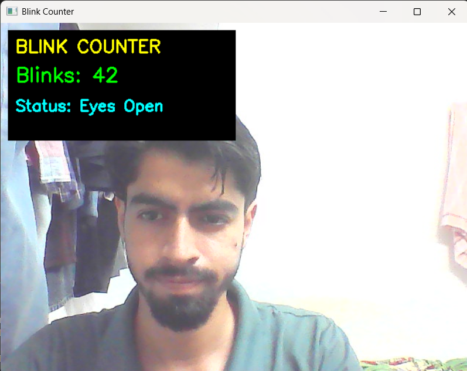

# 👁️ Eye Blink Detection System
🚀 Real-time Eye Blink Detection using Computer Vision  

## 📌 Overview

This project detects eye blinks in real-time using computer vision and facial landmark detection. It uses the **Eye Aspect Ratio (EAR)** technique to determine whether eyes are open or closed.

---

## 🧠 How It Works

* Detects face using MediaPipe
* Extracts eye landmarks
* Calculates **EAR (Eye Aspect Ratio)**
* If EAR drops below a threshold → blink detected

---

## ⚙️ Tech Stack

* Python
* OpenCV
* MediaPipe
* NumPy

---

## 🚀 Features

* Real-time face detection
* Eye blink detection using EAR
* Lightweight and fast
* Webcam-based tracking
* Detects real-time eye state (open/closed)

---

## 📸 Demo  

### 👁️ Eyes Open  



### 😴 Eyes Closed  


---

## ▶️ How to Run

### 1. Install dependencies

```bash
pip install -r requirements.txt
```

### 2. Run the project

```bash
python main.py
```

---

## 📂 Project Structure

```
eye-blink-detection/
│
├── detector/
├── utils/
├── config.py
├── main.py
├── requirements.txt
└── README.md
```

---

## 📊 Future Improvements

* Add GUI
* Improve accuracy
* Add alert system

---

## 👨‍💻 Author

Kushagra Mishra
